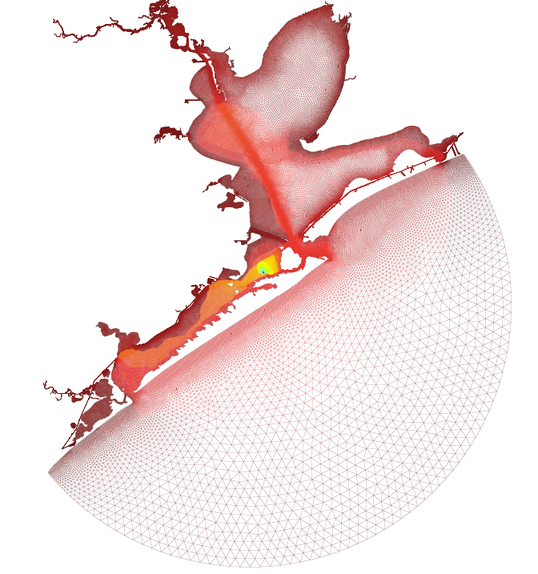
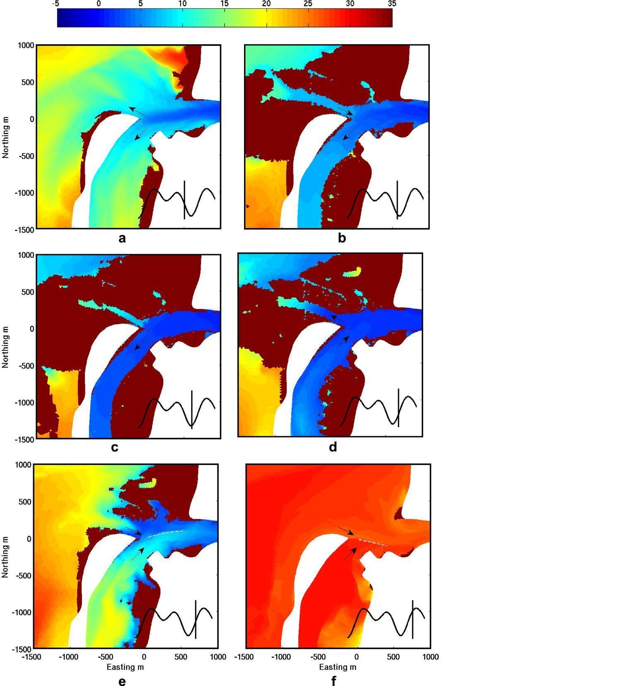

# SUNTANS

The Stanford unstructured-grid, nonhydrostatic, parallel coastal ocean model. For simulation of nonhydrostatic flows at high resolution in estuaries and coastal seas. Requires a grid generator and ParMETIS (if run in parallel).

Created by Oliver Fringer

 

### Quickstart Guide
Download the main source and examples from the GitHub repository here:
https://github.com/ofringer/suntans/archive/master.zip

Follow these steps:

1.  `unzip suntans-master.zip`
2.  `cd suntans-master/examples/cylinder`
3.  `make test`
4.  `cd ../../main`
5.  `make sunplot`
6.  `./sunplot --datadir=../examples/cylinder/data`
